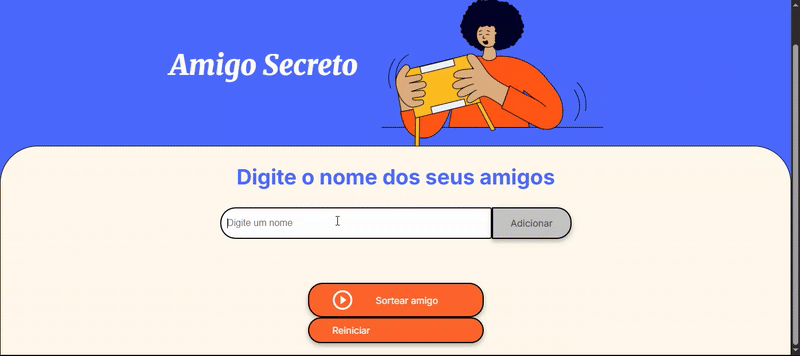

# 🎁 Amigo Secreto

**[Clique aqui para ver o projeto ao vivo!](https://CamiMM32.github.io/AmigoSecreto/)**

<br>



Este é um projeto de uma aplicação web simples para realizar sorteios de "Amigo Secreto" (Secret Santa). Desenvolvido como um desafio para praticar e aprimorar habilidades em lógica de programação utilizando HTML, CSS e JavaScript.

## ✨ Funcionalidades

A aplicação permite que os usuários:

- **Adicionar Participantes:** Inserir nomes em um campo de texto e adicioná-los a uma lista visível.
- **Validar Entradas:** O sistema impede a adição de nomes em branco ou duplicados para garantir a integridade do sorteio.
- **Visualizar a Lista:** Todos os nomes adicionados são exibidos de forma clara na tela.
- **Realizar o Sorteio:** Com um clique, a aplicação embaralha os nomes e atribui um "amigo secreto" para cada participante, garantindo que ninguém sorteie a si mesmo.
- **Reiniciar:** Um botão permite limpar todos os dados (lista de amigos e resultado) para começar um novo sorteio do zero.

## 🚀 Tecnologias Utilizadas

O projeto foi construído utilizando as seguintes tecnologias:

- 
- 
- 

## ⚙️ Como Executar o Projeto

Como este é um projeto front-end puro, não há necessidade de instalação de dependências ou de um servidor complexo.

1.  **Clone o repositório** para a sua máquina local:
    ```bash
    git clone https://github.com/CamiMM32/AmigoSecreto.git
    ```
    (Lembre-se de substituir `seu-usuario` pelo seu nome de usuário no GitHub).

2.  **Navegue até a pasta** do projeto:
    ```bash
    cd challenge-amigo-secreto_pt-main
    ```

3.  **Abra o arquivo `index.html`** no seu navegador de preferência (Google Chrome, Firefox, etc.).

Pronto! Agora você pode adicionar os nomes dos seus amigos e realizar o sorteio.

## 📝 Lógica do Sorteio

A lógica principal do sorteio está no arquivo `app.js`. Para garantir um sorteio justo e sem erros, foram implementados os seguintes passos:

1.  **Validação:** O sorteio só é permitido se houver 4 ou mais participantes.
2.  **Embaralhamento:** A lista de amigos é embaralhada aleatoriamente utilizando o algoritmo de **Fisher-Yates**, que é eficiente e garante uma distribuição uniforme.
3.  **Atribuição:** Após embaralhar, o sistema cria um "círculo" onde cada pessoa da lista sorteia a próxima. O último participante da lista sorteia o primeiro, fechando o ciclo e garantindo que todos tenham um par e que ninguém sorteie a si mesmo.

## ✒️ Autor

Este projeto foi desenvolvido por **[Camila Moreira](https://github.com/CamiMM32)**
